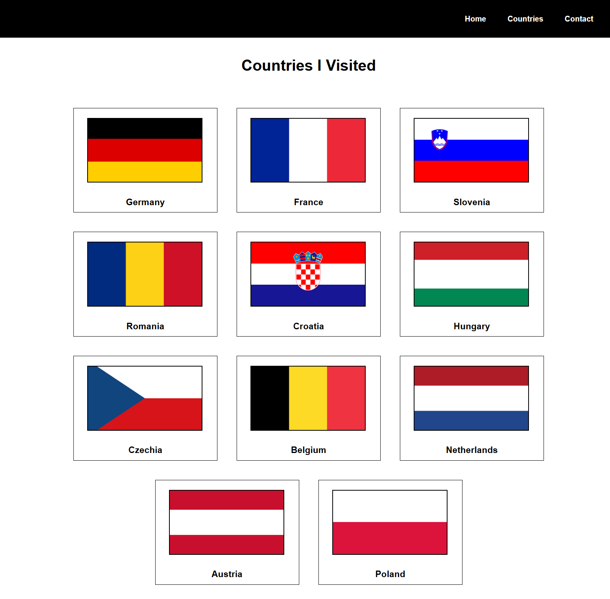
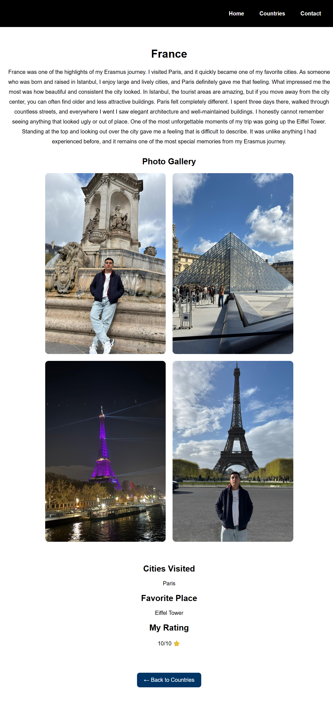
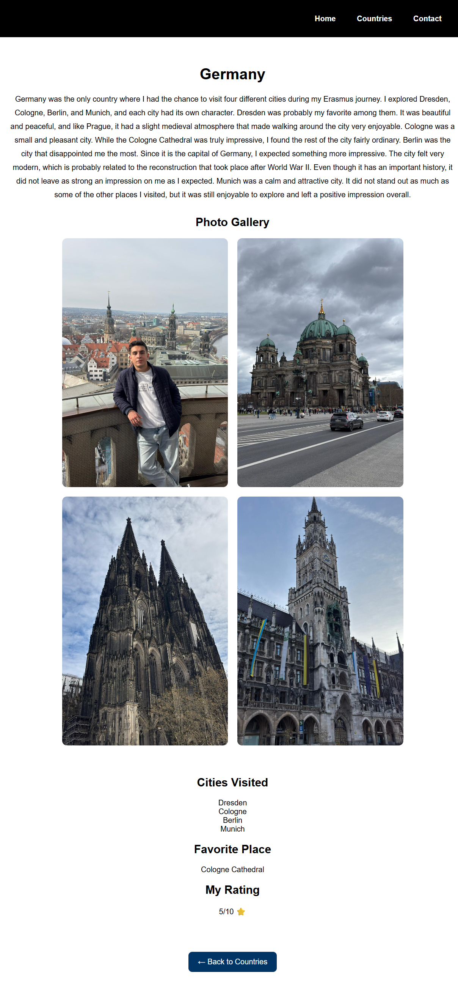

# Erasmus Blog

A personal travel blog built with HTML and CSS, showcasing the countries and cities I visited during my Erasmus journey across Europe.

## Live Demo

Visit the website here:

https://harunilkerkaya.github.io/erasmus-blog/

## About the Project

This project was created to share my Erasmus travel experiences and improve my front-end web development skills.

The website contains dedicated pages for the countries I visited, including personal travel stories, photo galleries, and reflections from my time abroad.

## Features

* Multi-page website structure
* Responsive design
* Interactive navigation menu
* Individual country pages
* Photo galleries
* Personal travel experiences and ratings
* Hosted with GitHub Pages

## Screenshots

### Countries Page




### Hungary Page


### France Page



### Germany Page



## Technologies Used

* HTML5
* CSS3
* Flexbox
* Git
* GitHub
* GitHub Pages

## Project Structure

```text
index.html
countries.html
about.html
contact.html
style.css

country-pages/
├── austria.html
├── belgium.html
├── croatia.html
├── czechia.html
├── france.html
├── germany.html
├── hungary.html
├── netherlands.html
├── poland.html
├── romania.html
└── slovenia.html

images/
```

## What I Learned

Through this project, I practiced:

* Building a complete multi-page website
* Creating responsive layouts with CSS
* Working with image galleries
* Using Git and GitHub for version control
* Publishing a live website with GitHub Pages

## Author

Harun İlker Kaya

Software Engineering Student
